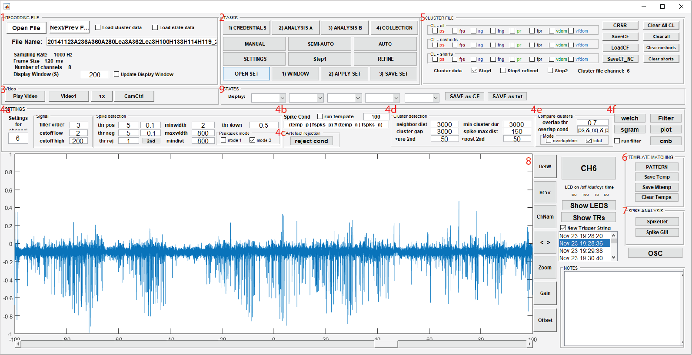

Spike Cluster Analyzer UI
-------------------------

1. Recording File
^^^^^^^^^^^^^^^^^

1. **Open File** - Opens .mat file containing EEG data from previous recorders

2. **Next/Prev File** - Left-click opens the previous recording file in the same folder, if available. Right-click opens the next file.

3. **Load cluster data** - Loads the cluster data if a "_cluster.mat"-file is available in the same directory as the corresponding recording file

4. **Load state data** - Loads the state data if a "_fft_ch_X.mat"-file ("X" for a particular channel number) is available in the same directory as the corresponding recording file

5. **Display Window** (s) - Changes the view of the recording within the analyzer. The number specifies the timespan shown in the window.

6. **Update Display Window** - Allows zooming in with left mouse click

2. Tasks
^^^^^^^^

1. **CREDENTIALS** - Input and save information about the subject of the recording (".cre"-file)

2. **ANALYSIS A** - Initial analysis for detection and adjustment of clusters (i.e. "define ROI")

   - **MANUAL** - Mode to input the start and stop of clusters manually

   - **SEMI-AUTO** - Mode to automatically detect clusters after setting parameters

     * **SETTINGS**

       #. **OPEN SET** - Open previously saved settings (e.g. from another timepoint or another subject; ".one"-file)

       #. **WINDOW** - Sets the boundaries of the data to the current viewing window

       #. **APPLY SET** - Applies all settings (specified in **4a**) to the current viewing window to detect clusters

       #. **SAVE SET** - Saves settings (".one"-file) 

     * **Step1** - Applies settings saved in **3) SAVE SET** (i.e. ".one"-file) to all the recording files within the same folder (Important: directory has to contain only one ".cre"- and one ".one"-file as well as only recording files - no "_cluster.mat"-files)

     * **REFINE** - Allows adjustment (i.e. deletion/creation) of cluster markers made during the MANUAL, SEMI-AUTO, and AUTO modes

   - **AUTO** - Still in progress (eventually no parameters need to be set)

3. **ANALYSIS B** - Analysis of the clusters detected in ANALYSIS A with settings specified in **4a** (i.e. "analyze ROI") (Important: cluster data has to be loaded and cluster type, e.g. "all ps", has to be selected)

4. **COLLECTION** - Collecting results from "ANALYSIS A" and "ANALYSIS B" (i.e. from several "_cluster.mat" files) and plotting/saving them to Excel (statistic not implemented yet)

3. Video
^^^^^^^^

1. **Play Video** - Plays the recording's corresponding video according to the length of the viewing window

2. **Video1** - Click to rotate through different videos

3. **1x** - Speed of video playback

4. **CamCtrl** - Asign cameras to specific EEG channels

4a. Settings
^^^^^^^^^^^^

1. **Settings for channel** - Specify the channel of the recording that will be analyzed (Important: has to match with channel displayed - common mistake)

2. **Signal**

  - **filter order** - Defined as the maximum delay, in samples, used in creating each output sample (default: 3)

  - **cutoff low** - Lower cutoff frequency of bandpass Butterworth filter 

  - **cutoff high** - Higher cutoff frequency of bandpass Butterworth filter

3. **Spike detection** (i.e. peak detection using Peakseek algorithm and threshold, as well as inclusion criteria)

  - **thr pos** - Positive threshold

  - **thr neg** - Negative threshold

  - **thr rej** - Threshold for rejecting spikes (i.e. rejecting peaks above this threshold to exclude artefacts)

  - **2nd** (button) - Automatically sets 2nd thresholds (positive and negative) from horizontal cursors ("HCur") for re-analyzing spikes in "ANALYSIS B"

  - **minwidth** - Minimum width of spike for inclusion (defined in a certain distance below the peak; "thr down")

  - **maxwidth** - Maxiumum width of spike for inclusion (defined in a certain distance below the peak; "thr down")

  - **mindist** - Minimum distance between peaks for inclusion

  - **thr down** - Threshold down defines a certain distance below the peak (important for "minwidth" and "maxwidth" inclusion criteria)

  - **Peakseek mode** - Peakseek algorithm using a steady threshold (mode 1) or a thrshold in form of a low-pass (20Hz) filtered signal (mode 2) 

4b. Spike Cond
^^^^^^^^^^^^^^

**run template** - Also use template(s) for spike detection (e.g. "temp_p" for positive spikes) and combine them with the spikes from the regular spike detection (e.g. "fspks_p" for positive spikes) using Boolean logic (e.g. "(temp_p | fspks_p) # (temp_n | fspks_n)" to combine positive with positive and negative with negative), while defining the distance (e.g. 100 msec) when they should be merged (i.e. just keep one peak/spike within this time window)  

4c. Artefact rejection
^^^^^^^^^^^^^^^^^^^^^^

Criteria for artefact rejection

   - **Filters** - Four different signal filters that can be combined (Boolean logic) to determine signal that should be excluded

   - **cmb** - Thresholds and variance of different signal properties (including amplitude, coastline, intermittency, spikiness, asymmetry, periodicity and frequency) to determine signal that should be excluded (Note: some of the code was originally developed in Tcl (Tool Command Language) and Pascal by Open Source Instruments (http://alignment.hep.brandeis.edu/Software/Sources/))

   - **Total rejection condition** - Actual artefact rejection is based on Boolean logic, combining conditions in "Filters" and "cmb"

4d. Cluster detection
^^^^^^^^^^^^^^^^^^^^^

1. **neighbor dist** (ms) - Maximal distance between two spikes in order to be still considered cluster spikes (vs. single spikes) - value usually similar to "cluster gap"

2. **cluster gap** (ms) - Minimal distance between two spikes to belong to two separate clusters (used after "neighbor dist" to determine cluster start locations) - value usually similar to "neighbor dist"

3. **min cluster dur** (ms) - Minimum cluster duration that defines "short clusters" (separat category in panel "CLUSTER FILE")

4. **spike max dist** (ms) - Maximum distance by which a negative and positive spike can be considered a pair (used to define "paired clusters" containing only spike with pos-neg pair)

5. **+pre 2nd** - Moving the cluster start some milliseconds earlier for "ANALYSIS B" (Reason: in "ANALYSIS A" the cluster start is usually defined at the location of the peak of the first cluster spike) 

6. **+post 2nd** - Moving the cluster stop some milliseconds later for "ANALYSIS B" (Reason: in "ANALYSIS A" the cluster stop is usually defined at the location of the peak of the last cluster spike) 

4e. Compare clusters
^^^^^^^^^^^^^^^^^^^^

1. **overlap thr** - The percentage overlap needed to be considered a vdom/vfdom cluster (for example, a cluster detected using positive spike thresholds that overlaps 80% with a cluster detected using negative spike thresholds, will be considered one vdom/vfdom cluster)

2. **overlap cond** - Boolean logic to define, which clusters are compared for the overlap (ps-positive spikes, ng-negative spikes, pr-paired spikes)

3. **Mode**

  - **overlap/dom** - Only the overlap between clusters will be counted as the new cluster (AND-condition)

  - **total** - The full length of the overlapping clusters will be counted as the new cluster (OR-condition)

4f. Various settings
^^^^^^^^^^^^^^^^^^^^

1. **welch** - Welch's power spectral density estimation

2. **sgram** - FFT and PCA of signal

3. **Filter** - Various signal filters with individual thresholds to detect events

4. **plot** - Sets which plots will be made during **2) APPLY SET** and **Step 1**

5. **cmb** - Analyze different signal properties (including amplitude, coastline, intermittency, spikiness, asymmetry, periodicity and frequency) for each cluster (Note: some of the code was originally developed in Tcl (Tool Command Language) and Pascal by Open Source Instruments (http://alignment.hep.brandeis.edu/Software/Sources/))

6. **run filter** - Checkmark to run "Filter"

5. Cluster File
^^^^^^^^^^^^^^^

1. **CL**

  - **ps** - clusters detected using positive spikes

  - **fps** - clusters detected using positive spikes filtered to remove artefacts (defined by **reject cond**)

  - **ng** - clusters detected using negative spikes

  - **fng** - clusters detected using negative spikes filtered to remove artefacts (defined by **reject cond**)

  - **pr** - clusters defined using pairs of negative and positive spikes (defined using **spike max dist** in 4c and thresholds in 4a)

  - **fpr** - clusters defined using pairs of negative and positive spikes (defined using **spike max dist** in 4c and thresholds in 4a), filtered to remove artefacts (defined by **reject cond**)

  - **vdom** - clusters formed from merges of different criteria (ps/ng/pr) defined using **4d) Compare clusters**

  - **vfdom** - clusters found using vdom, filtered to remove artefacts (defined by **reject cond**)

2. **CRSR** - Vertical cursors (old - can be removed)

3. **SaveCF** - Saves CF after going through **Refine** to adjust clusters

4. **LoadCF** - Loads cluster file (if recording file is loaded, cluster file can be loaded from a different directory than recording file)

5. **SaveCF_NC** - Clears current recordings and saves new (???) (old - can probably removed, but check first)

6. **Clear All CL** - Clears all clusters (categories "all", "noshorts" and "shorts") from the current file (working memory)

7. **Clear all** - Clears all clusters of the category "all" from the current file (working memory)

8. **Clear noshorts** - Clears all clusters of the category "noshorts" from the current file (working memory)

9. **Clear shorts** - Clears all clusters of the category "shorts" from the current file (working memory)

6. Template Matching
^^^^^^^^^^^^^^^^^^^^

1. **Pattern** - Run pattern detection (template matching) (Important: directory of master template has to be specify here, if **run template** is selected in "Spike Cond")

2. **Save Temp** - Save signal marked with cursors as a template

3. **Save Mtemp** - Save master templates by loading several templates 

4. **Clear Temps** - Delete spike indicators (stars, etc.) on display window after running **PATTERN** or **2) APPLY SET**

7. Spike Analysis
^^^^^^^^^^^^^^^^^

1. **SpikeDet** - Manually include or exclude spikes detected in "ANALYSIS A" or "ANALYSIS B"

2. **Spike GUI** - Separate GUI to further analyze spikes detected in "ANALYSIS A" or "ANALYSIS B"

3. **OSC** - Separate GUI to further analyze various signal features as well as clusters detected in "ANALYSIS A" or "ANALYSIS B" (modified from original version developed by MO and CV)

8. Recording Viewer Settings
^^^^^^^^^^^^^^^^^^^^^^^^^^^^

1. **DelW** - Closes all plot windows

2. **HCur** - Horizontal cursors

3. **ChNam** - Lists channel names

4. **< >** - Move forward (left click) and backward (right click) after zooming (required if "Update Display Window" is not selected)

5. **Zoom** - Left click: zoom into the recording, Right click: zoom out of recording

6. **Gain** - Left click: increases gain, Right click: decreases gain

7. **Offset** - Left click: increases offset from baseline, Right click: decreases offset from baseline